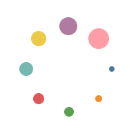
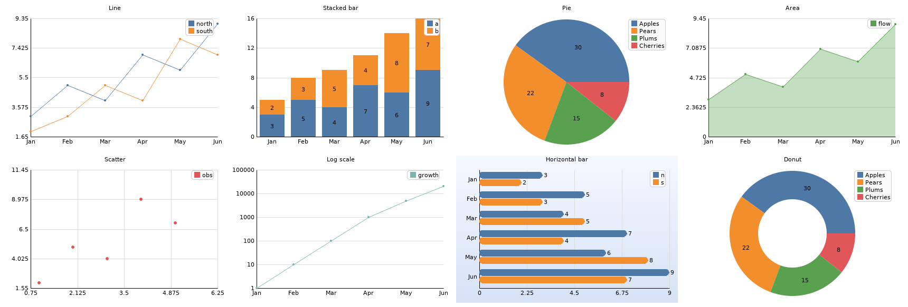
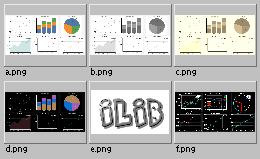
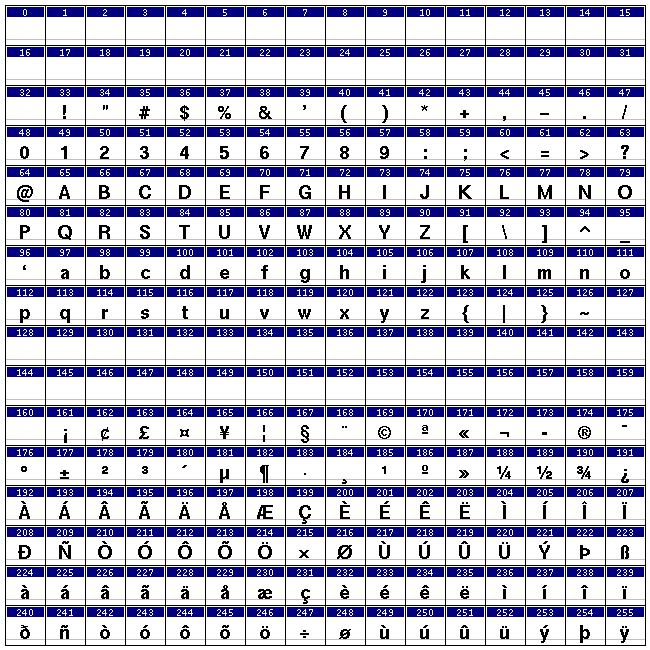
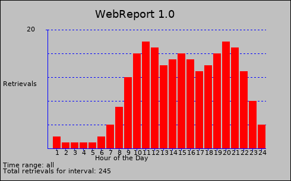
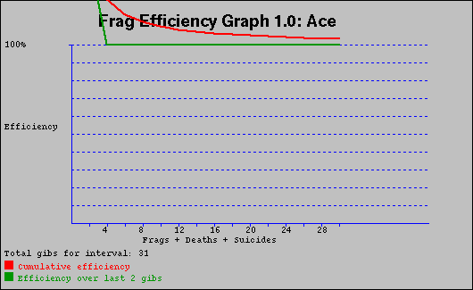

# Gallery

Every image here is real output from Ilib, regenerated by a script in
[`docs/samples/`](samples) so it stays in sync with the code.

## Animation

A looping animated GIF: a rotating ring of dots over a smooth two-hue gradient.
The gradient has far more than 256 colors, so the GIF writer quantizes it — the
animation is written **with dithering** so the backdrop stays smooth instead of
banding. Drawn and assembled by
[`docs/samples/animation.py`](samples/animation.py) (drawing API → `IAnimation`
→ dithered GIF89a writer).



```sh
# The equivalent from the shell, given frame images:
ilib-anim assemble --delay 70 --loop 0 --dither -o anim-demo.gif frame-*.png
```

## Charts

The seven chart types of the `Ichart.h` layer — line, stacked bar, pie, area,
scatter, log-scale line, horizontal bar and donut — rendered with anti-aliased
TrueType text and montaged by
[`docs/samples/charts.py`](samples/charts.py). The `ilib-chart` CLI renders any
one of these from a CSV.



## Client tools

Real output from the bundled `ilib-*` command-line tools, produced by
[`docs/samples/generate.sh`](samples/generate.sh).

| | |
|---|---|
| **`ilib-index`** — thumbnail contact sheet | **`ilib-displayfont`** — X11 BDF glyph table |
|  |  |
| **`ilib-webreprt`** — web access-log usage by hour | **`ilib-fraggraph`** — a player's frag efficiency |
|  |  |
